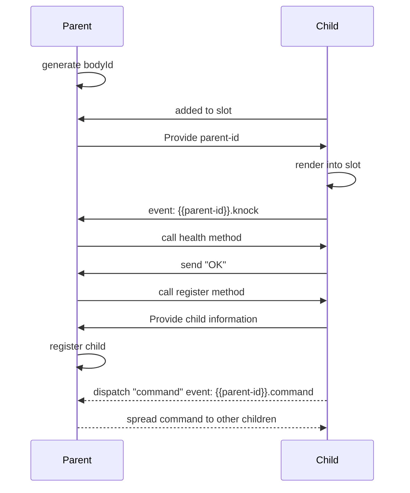

# BodyBloks

Bodybloks allows you to nest custom webcomponents that then create a communication scope with each other which is based on a simple command structure.

## Getting started

Just add `bodybloks-core` to your project with a package manager of your choice.

```sh
pnpm -D i bodybloks-core
```

## The base class

The baseclass `BodyBlok` is in charge of creating that communication scope between a parent and it's nested children.

It will provide basic functions for listening to newly appended children, registering children and sending commands to children.

The `BodyBlok` will also provide some basic attributes that can be utilized by a custom webcomponent that inherits the class.

```ts
// A small typescript example
class MyBlok extends BodyBlok {
  override render() {
    return `
      <div class="my-blok">
        <p>Hi, mom. I'm a block</p>
        <slot></slot>
      </div>
    `;
  }
}

customElements.define('my-blok', MyBlok);
```

You can now use the custom webcomponent `MyBlok` in a page like:

```html
<!-- you need to switch that to a .js file for production -->
<script type="module" src="path/to/my/module.ts"></script>

<my-blok>
  <my-blok></my-blok>
  <my-blok></my-blok>
  <my-blok>
    <my-blok></my-blok>
    <my-blok>
      <my-blok></my-blok>
    </my-blok>
  </my-blok>
</my-blok>
```

You will see, that each block will on runtime generate a `body-id` and be provided with the `parent-id` by it's parent.

## What happens next?

Now the nested components will start communicating with each other. The basic approach is the following. Each `BodyBlok` has a `slotchange` event listener on all it's slots. All new children coming in will be provided with the `body-id` of the parent `Body-Blok`. This will be provided as `parent-id`.

Now every `BodyBlok` child will emit an event with the name of `{{parent-id}}.knock` providing a simple `health` function and a `register` function that can be called by the parent.

The parent will listen to those knock events, calling the health and register functions on the child and add it to it's on array of `registeredBodies`. In this process it will provide a command event with the name of `{{parent-id}}.command`.

Now the basic setup is complete and the communication scope is set. Each child of the parent can now emit command events, that are listened to by the parent. The parent will then take care of handing the commands down to possible recipients.

## The command structure

A command is a simple object containing basic information. A command could look like this:

```ts
const command = {
  action: {
    type: 'ROTATE',
    degrees: 12
  };
  origin: this.bodyId;
  targetType: 'HAND';
};
```

The basic apporach for communication via commands is the following.


